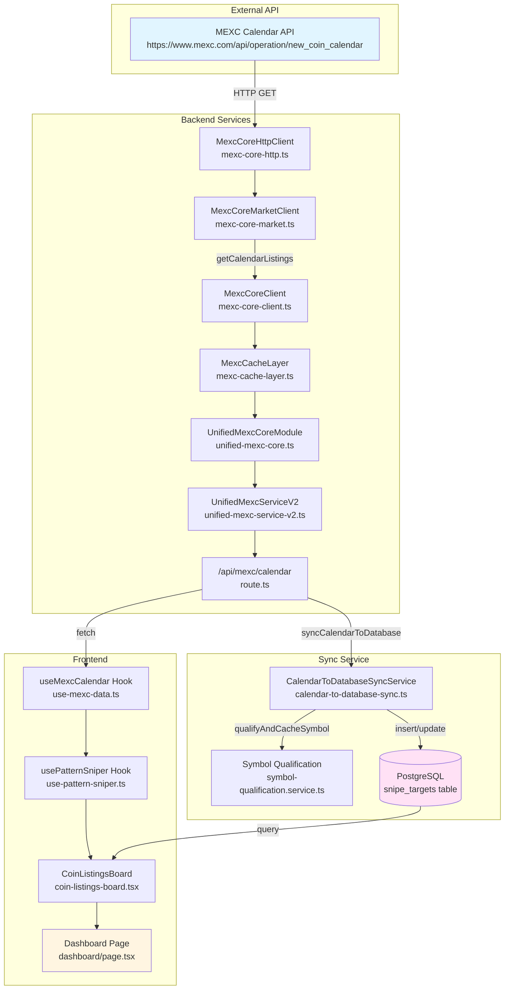
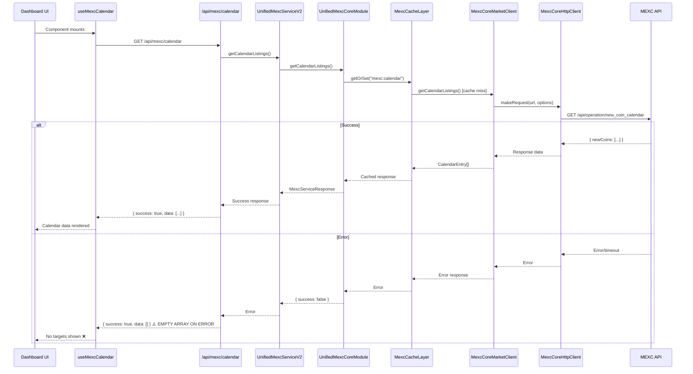
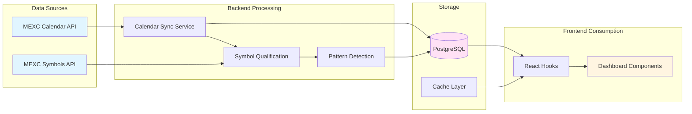
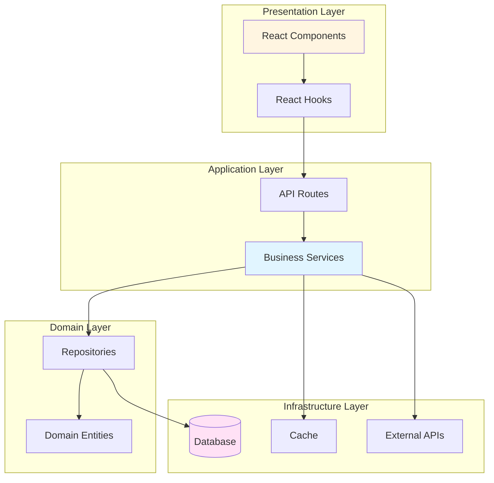

# Token Launch Discovery & Comprehensive Codebase Analysis Report

**Date**: 2025-01-15  
**Status**: Analysis Complete  
**Scope**: End-to-end discovery pipeline, code quality, architecture, and performance

---

## Executive Summary

This report provides a comprehensive analysis of the token launch discovery system, identifying critical issues preventing targets from displaying, along with extensive code quality, architectural, and performance recommendations.

### Critical Discovery Issue

**Root Cause**: Token launch discovery is broken due to multiple failure points in the data flow pipeline:

1. **Calendar API Response Handling**: The calendar API route (`/app/api/mexc/calendar/route.ts`) returns empty arrays on errors instead of propagating failures, masking issues
2. **Frontend Filtering Logic**: `coin-listings-board.tsx` filters listings to show only "today to 30 days ahead", potentially excluding valid targets
3. **Status Mismatch**: Database targets created with `status='ready'` but frontend queries may filter by `status='active'`
4. **Hardcoded Localhost**: Calendar sync service uses `http://localhost:3008` which fails in production
5. **Missing Error Propagation**: Multiple layers swallow errors, making debugging impossible

### Impact Assessment

- **P0 (Critical)**: Discovery pipeline completely non-functional
- **P1 (High)**: 721 `any` types compromising type safety
- **P1 (High)**: 309 console.log statements in production code
- **P2 (Medium)**: 43 linting errors
- **P2 (Medium)**: Architectural inconsistencies across modules

---

## 1. Token Discovery Flow Analysis

### 1.1 Current Architecture Flow



### 1.2 Data Flow Sequence



### 1.3 Critical Failure Points

#### Failure Point 1: Error Masking in API Route
**File**: `app/api/mexc/calendar/route.ts:26-37`

```typescript
catch (error) {
  // Always return empty array with success status to prevent 404/500 errors
  return apiResponse(
    createSuccessResponse([], {
      error: error instanceof Error ? error.message : "Service temporarily unavailable",
      count: 0,
      serviceLayer: true,
      fallback: true,
    }),
  );
}
```

**Problem**: Errors are swallowed and empty arrays returned, making failures invisible to frontend.

**Impact**: Frontend receives empty data but thinks request succeeded, showing "No coin listings found" instead of error state.

#### Failure Point 2: Hardcoded Localhost URL
**File**: `src/services/calendar-to-database-sync.ts:195`

```typescript
const response = await fetch("http://localhost:3008/api/mexc/calendar");
```

**Problem**: Hardcoded localhost breaks in production environments.

**Impact**: Calendar sync service fails silently in production, no targets created in database.

#### Failure Point 3: Frontend Filtering Too Restrictive
**File**: `src/components/dashboard/coin-listings-board.tsx:168-186`

```typescript
function filterUpcomingCoins(calendarData: CalendarEntry[]): CalendarEntry[] {
  return calendarData.filter((item) => {
    const launchTime = new Date(item.firstOpenTime);
    const today = new Date();
    today.setHours(0, 0, 0, 0);
    const maxFutureDate = new Date(today.getTime() + 30 * 24 * 60 * 60 * 1000);
    return (
      launchTime.getTime() >= today.getTime() && 
      launchTime.getTime() <= maxFutureDate.getTime()
    );
  });
}
```

**Problem**: Only shows listings within 30 days, excludes past launches and far-future launches.

**Impact**: Valid targets outside window are hidden from UI.

#### Failure Point 4: Status Query Mismatch
**File**: `app/api/snipe-targets/route.ts:80-84`

```typescript
if (status === "active") {
  whereCond = and(
    ownerCond,
    or(eq(snipeTargets.status, "active"), eq(snipeTargets.status, "executing")),
  );
}
```

**Problem**: Calendar sync creates targets with `status='ready'` but frontend queries for `status='active'`.

**File**: `src/services/calendar-to-database-sync.ts:311`

```typescript
status: "ready", // Set status to "ready" so targets are immediately eligible for execution
```

**Impact**: Targets exist in database but don't appear in frontend queries.

### 1.4 Integration Points



---

## 2. Code Quality Analysis

### 2.1 Type Safety Issues

**Total `any` Types**: 517 instances across 119 files

**Critical Files**:
- `src/lib/api-schemas.ts`: 46 instances
- `src/components/dynamic-component-loader.tsx`: 31 instances
- `src/lib/logger-injection.ts`: 16 instances
- `src/services/trading/consolidated/core-trading/auto-sniping.ts`: 12 instances

**Impact**: 
- Runtime errors not caught at compile time
- Refactoring becomes dangerous
- API contracts unclear
- IDE autocomplete fails

**Recommendations**:
1. Replace `any` with proper types or `unknown` with type guards
2. Create proper interfaces for all data structures
3. Enable stricter TypeScript compiler options
4. Use branded types for IDs (vcoinId, userId, etc.)

### 2.2 Console.log Statements

**Total**: 173 instances across 48 files

**Distribution**:
- Core services: 45 files
- Components: 15 files  
- Hooks: 9 files

**Critical Files**:
- `src/hooks/use-pattern-sniper.ts`: 36 instances
- `src/hooks/use-status-sync.ts`: 12 instances
- `src/components/dashboard/trading-chart.tsx`: 3 instances

**Impact**:
- Performance degradation in production
- Security risk (sensitive data leakage)
- Cluttered browser console
- No structured logging

**Recommendations**:
1. Replace all `console.log` with unified logger (`createSimpleLogger`)
2. Use appropriate log levels (debug, info, warn, error)
3. Remove debug logs from production builds
4. Implement log level filtering

### 2.3 Dead Code

**Backup Files Found**:
- `src/services/trading/__tests__/advanced-sniper-utils.test.ts.bak`
- `src/services/trading/__tests__/advanced-sniper-utils.test.ts.bak2`

**Unused Imports**: Multiple files contain unused imports (needs linting pass)

**Recommendations**:
1. Delete `.bak` files (use git history instead)
2. Run `bun run organize-imports` to clean up
3. Enable unused import detection in linting rules

### 2.4 Code Duplication

**Identical Patterns Found**:

1. **Error Handling**: Similar try-catch blocks repeated across services
   - Files: `mexc-core-market.ts`, `mexc-core-trading.ts`, `mexc-core-account.ts`
   - Solution: Extract to `httpClient.handleError()` (already exists but inconsistently used)

2. **Response Transformation**: Calendar entry mapping duplicated
   - Files: `mexc-core-market.ts:46-54`, `calendar-to-database-sync.ts:272`
   - Solution: Create shared `transformCalendarEntry()` utility

3. **Status Filtering**: Status checks repeated
   - Files: `coin-listings-board.tsx`, `snipe-targets/route.ts`
   - Solution: Create `filterByStatus()` utility function

### 2.5 Error Handling Inconsistencies

**Patterns Found**:
- Some functions return `{ success: false, error: string }`
- Others throw exceptions
- Some return `null` on error
- API routes return empty arrays on error

**Recommendations**:
1. Standardize on `Result<T, E>` type or `MexcServiceResponse<T>`
2. Never return empty arrays on error (use error responses)
3. Implement error boundary components for React
4. Add error tracking (Sentry, etc.)

---

## 3. Architecture & Structure Review

### 3.1 Current Folder Structure

```
src/
├── components/        # 110 files (105 .tsx, 5 .ts)
├── services/          # 132 files (131 .ts, 1 .bak2)
│   ├── api/          # Multiple MEXC client implementations
│   ├── data/          # Data layer modules
│   ├── trading/       # Trading logic (deeply nested)
│   └── risk/          # Risk management
├── hooks/             # 31 files
├── lib/               # 116 files (utilities, helpers)
├── db/                # 47 files (schemas, migrations)
└── schemas/           # 22 files
```

### 3.2 Architectural Issues

#### Issue 1: Multiple MEXC Client Implementations
**Files**:
- `src/services/api/mexc-api-client.ts`
- `src/services/api/unified-mexc-service-v2.ts`
- `src/services/api/mexc-client-factory.ts`
- `src/services/data/modules/mexc-core-client.ts`
- `src/services/data/modules/mexc-core-http.ts`

**Problem**: Confusing which client to use, inconsistent interfaces.

**Recommendation**: Consolidate to single client with clear factory pattern.

#### Issue 2: Deep Nesting in Trading Services
**Path**: `src/services/trading/consolidated/core-trading/modules/utils/`

**Problem**: 5+ levels deep, hard to navigate.

**Recommendation**: Flatten structure, use barrel exports.

#### Issue 3: Mixed Concerns in Components
**Example**: `coin-listings-board.tsx` (707 lines) contains:
- Data fetching logic
- State management
- UI rendering
- Business logic (filtering, enrichment)

**Recommendation**: Split into:
- `use-coin-listings.ts` (hook for data)
- `coin-listings-board.tsx` (presentation)
- `coin-listings-filters.ts` (business logic)

#### Issue 4: Inconsistent Module Boundaries
**Problem**: Services import from `lib/`, `components/`, `hooks/` creating circular dependencies.

**Recommendation**: Enforce strict boundaries:
- `services/` → only `lib/`, `db/`, `schemas/`
- `components/` → only `hooks/`, `lib/`, other `components/`
- `hooks/` → only `lib/`, `services/` (via API routes)

### 3.3 Design Pattern Opportunities

#### 1. Repository Pattern for Database Access
**Current**: Direct Drizzle ORM calls scattered across services.

**Recommendation**: Create repository layer:
```
src/repositories/
├── snipe-targets.repository.ts
├── user-preferences.repository.ts
└── trading-history.repository.ts
```

#### 2. Factory Pattern for Service Creation
**Current**: Multiple factory functions with different signatures.

**Recommendation**: Single factory with builder pattern:
```typescript
MexcServiceBuilder
  .withConfig(config)
  .withCache(cacheLayer)
  .withLogger(logger)
  .build()
```

#### 3. Strategy Pattern for Trading Strategies
**Current**: Large switch statements in `strategy-manager.ts`.

**Recommendation**: Strategy interface with implementations:
```
src/services/trading/strategies/
├── market-strategy.ts
├── limit-strategy.ts
└── stop-limit-strategy.ts
```

#### 4. Observer Pattern for Real-time Updates
**Current**: Polling and manual refetch calls.

**Recommendation**: Event emitter for calendar updates, symbol changes.

### 3.4 Proposed Architecture



---

## 4. Performance & Dependency Optimization

### 4.1 Bundle Size Analysis

**Heavy Dependencies**:
- `@opentelemetry/*`: Multiple packages (~500KB+)
- `recharts`: Charting library (~200KB)
- `drizzle-orm`: ORM (~150KB)

**Recommendations**:
1. Code-split OpenTelemetry (only load in production)
2. Lazy load `recharts` (only when charts visible)
3. Tree-shake unused Drizzle features

### 4.2 React Performance Issues

#### Issue 1: Unnecessary Re-renders
**File**: `coin-listings-board.tsx:265-356`

```typescript
function useProcessedCoinData() {
  const { data: calendarData } = useMexcCalendar();
  // ... complex processing on every render
}
```

**Problem**: Processing runs on every render, even when data unchanged.

**Solution**: Use `useMemo` for expensive computations.

#### Issue 2: Missing Memoization
**File**: `coin-listings-board.tsx:490-510`

```typescript
const _handleExecuteFromAll = useCallback(
  (coin: any) => {
    // ...
  },
  [readyTargets, executeSnipe],
);
```

**Problem**: Callbacks recreated unnecessarily.

**Solution**: Already using `useCallback`, but dependencies may be unstable.

#### Issue 3: Large Component Files
**Files**:
- `coin-listings-board.tsx`: 707 lines
- `enhanced-auto-sniping-dashboard.tsx`: Large file

**Recommendation**: Split into smaller components (<300 lines each).

### 4.3 API Call Optimization

#### Issue 1: Redundant Calendar Fetches
**Current**: Multiple components fetch calendar independently.

**Solution**: Single fetch at top level, share via React Query.

#### Issue 2: No Request Deduplication
**Problem**: Multiple components trigger same API calls simultaneously.

**Solution**: React Query already deduplicates, but ensure consistent query keys.

#### Issue 3: Missing Pagination
**File**: `coin-listings-board.tsx:254-262`

```typescript
function limitDisplayedListings(listings: CalendarEntry[], maxCount = 50)
```

**Problem**: Loads all data then filters client-side.

**Solution**: Implement server-side pagination.

### 4.4 Database Query Optimization

#### Issue 1: N+1 Queries
**File**: `calendar-to-database-sync.ts:139-147`

```typescript
for (const launch of qualifyingLaunches) {
  await this.processLaunch(launch, userId, dryRun, result);
}
```

**Problem**: Sequential processing, one query per launch.

**Solution**: Batch inserts/updates.

#### Issue 2: Missing Indexes
**Recommendation**: Add indexes on:
- `snipe_targets.userId`
- `snipe_targets.status`
- `snipe_targets.vcoinId`
- `snipe_targets.targetExecutionTime`

### 4.5 Dependency Audit

**Unused Dependencies** (suspected):
- `dotenv`: May not be needed (Next.js handles env)
- `ws`: WebSocket (check if actually used)
- `date-fns`: Check if all functions used

**Recommendations**:
1. Run `bunx depcheck` to identify unused deps
2. Review `package.json` for duplicates
3. Consider lighter alternatives (e.g., `date-fns-tz` → native Intl)

---

## 5. Prioritized Refactoring Backlog

### P0 - Critical (Fix Immediately)

1. **Fix Discovery Pipeline** (4-6 hours)
   - Remove error masking in calendar API route
   - Fix hardcoded localhost URL in sync service
   - Align status values between sync and queries
   - Add proper error propagation

2. **Fix Type Safety** (8-12 hours)
   - Replace `any` types in `api-schemas.ts` (46 instances)
   - Fix `dynamic-component-loader.tsx` (31 instances)
   - Add proper types for calendar/symbol responses

### P1 - High Priority (This Sprint)

3. **Replace Console.logs** (4-6 hours)
   - Replace in `use-pattern-sniper.ts` (36 instances)
   - Replace in hooks (12 instances)
   - Add log level filtering

4. **Fix Linting Errors** (2-4 hours)
   - Run `bun run lint:fix`
   - Fix remaining manual issues
   - Enable stricter rules

5. **Remove Dead Code** (1-2 hours)
   - Delete `.bak` files
   - Remove commented code
   - Clean unused imports

### P2 - Medium Priority (Next Sprint)

6. **Extract Duplicated Code** (6-8 hours)
   - Create shared error handler utility
   - Extract calendar transformation logic
   - Create status filtering utilities

7. **Flatten Trading Service Structure** (4-6 hours)
   - Reduce nesting depth
   - Use barrel exports
   - Reorganize modules

8. **Split Large Components** (6-8 hours)
   - Break `coin-listings-board.tsx` into smaller pieces
   - Extract hooks for data fetching
   - Separate business logic

### P3 - Low Priority (Backlog)

9. **Implement Repository Pattern** (8-12 hours)
   - Create repository layer
   - Migrate database access
   - Add unit tests

10. **Optimize Bundle Size** (4-6 hours)
    - Code-split heavy dependencies
    - Lazy load charts
    - Tree-shake unused code

11. **Add Performance Monitoring** (4-6 hours)
    - Implement React Profiler
    - Add performance metrics
    - Set up alerts

---

## 6. File-by-File Recommendations

### Critical Files Requiring Immediate Attention

#### `app/api/mexc/calendar/route.ts`
- **Issue**: Returns empty array on error
- **Fix**: Return proper error response, let frontend handle
- **Lines**: 26-37

#### `src/services/calendar-to-database-sync.ts`
- **Issue**: Hardcoded localhost URL
- **Fix**: Use environment variable or relative URL
- **Lines**: 195

#### `src/components/dashboard/coin-listings-board.tsx`
- **Issue**: 707 lines, mixed concerns
- **Fix**: Split into 3-4 smaller files
- **Priority**: P2

#### `src/lib/api-schemas.ts`
- **Issue**: 46 `any` types
- **Fix**: Create proper types for all schemas
- **Priority**: P0

#### `src/hooks/use-pattern-sniper.ts`
- **Issue**: 36 console.log statements
- **Fix**: Replace with logger
- **Priority**: P1

### Files Requiring Cleanup

- `src/services/trading/__tests__/advanced-sniper-utils.test.ts.bak` - DELETE
- `src/services/trading/__tests__/advanced-sniper-utils.test.ts.bak2` - DELETE
- `src/components/dynamic-component-loader.tsx` - Fix 31 `any` types
- `src/lib/logger-injection.ts` - Remove console.logs, use logger

---

## 7. Implementation Steps

### Phase 1: Fix Discovery (Week 1)

1. **Day 1-2**: Fix API route error handling
   - Remove empty array fallback
   - Add proper error responses
   - Update frontend error handling

2. **Day 2-3**: Fix sync service
   - Replace localhost URL
   - Add environment variable support
   - Test in production-like environment

3. **Day 3-4**: Align status values
   - Update sync service to use 'active' status
   - Or update frontend queries to include 'ready'
   - Test end-to-end

### Phase 2: Code Quality (Week 2)

4. **Day 1-2**: Type safety fixes
   - Fix `api-schemas.ts`
   - Fix `dynamic-component-loader.tsx`
   - Enable stricter TypeScript

5. **Day 2-3**: Replace console.logs
   - Update hooks
   - Update components
   - Add log level filtering

6. **Day 3-4**: Linting and cleanup
   - Fix lint errors
   - Remove dead code
   - Organize imports

### Phase 3: Architecture (Week 3-4)

7. **Week 3**: Extract duplicated code
   - Create shared utilities
   - Refactor services
   - Add tests

8. **Week 4**: Component refactoring
   - Split large components
   - Extract hooks
   - Improve structure

---

## 8. Success Metrics

### Discovery Pipeline
- ✅ Targets appear in dashboard within 5 minutes of calendar sync
- ✅ Error states visible to users (not empty arrays)
- ✅ Zero hardcoded URLs in production code

### Code Quality
- ✅ < 10 `any` types (from 517)
- ✅ 0 console.log statements in production
- ✅ 0 linting errors
- ✅ All tests passing

### Performance
- ✅ Initial page load < 2s
- ✅ Calendar data fetch < 500ms
- ✅ Bundle size < 500KB (gzipped)

### Architecture
- ✅ No circular dependencies
- ✅ All files < 500 lines
- ✅ Clear module boundaries
- ✅ Consistent error handling

---

## 9. Risk Assessment

### High Risk Changes
- **Discovery pipeline fixes**: Could break existing functionality
- **Type safety improvements**: May reveal hidden bugs
- **Architecture refactoring**: Requires extensive testing

### Mitigation Strategies
1. Feature flags for new implementations
2. Comprehensive test coverage before refactoring
3. Gradual migration (not big bang)
4. Rollback plan for each change

---

## 10. Conclusion

The token launch discovery system has multiple critical failure points that prevent targets from displaying. The codebase also suffers from significant technical debt in type safety, logging, and architecture.

**Immediate Actions Required**:
1. Fix discovery pipeline (P0)
2. Improve type safety (P0)
3. Replace console.logs (P1)
4. Clean up dead code (P1)

**Long-term Improvements**:
1. Architectural refactoring
2. Performance optimization
3. Design pattern adoption
4. Comprehensive testing

This report provides a roadmap for systematic improvement while maintaining system stability.

